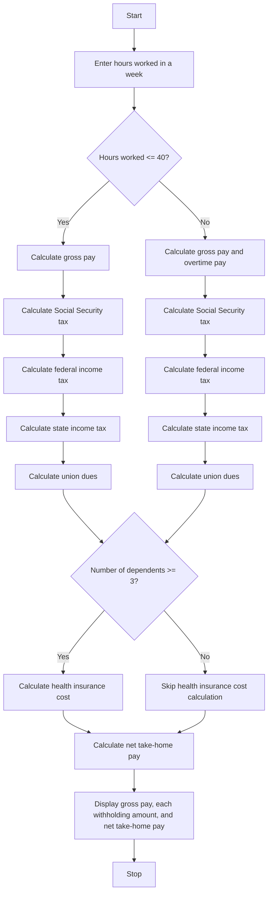

```mermaid
graph TD;
    A[Start] --> B[Enter hours worked in a week];
    B --> C{Hours worked <= 40?};
    C -->|Yes| D[Calculate gross pay];
    C -->|No| E[Calculate gross pay and overtime pay];
    D --> F[Calculate Social Security tax];
    E --> G[Calculate Social Security tax];
    F --> H[Calculate federal income tax];
    G --> I[Calculate federal income tax];
    H --> J[Calculate state income tax];
    I --> K[Calculate state income tax];
    J --> L[Calculate union dues];
    K --> M[Calculate union dues];
    L --> N{Number of dependents >= 3?};
    M --> N;
    N -->|Yes| O[Calculate health insurance cost];
    N -->|No| P[Skip health insurance cost calculation];
    O --> Q[Calculate net take-home pay];
    P --> Q;
    Q --> R[Display gross pay, each withholding amount, and net take-home pay];
    R --> S[Stop];
```
