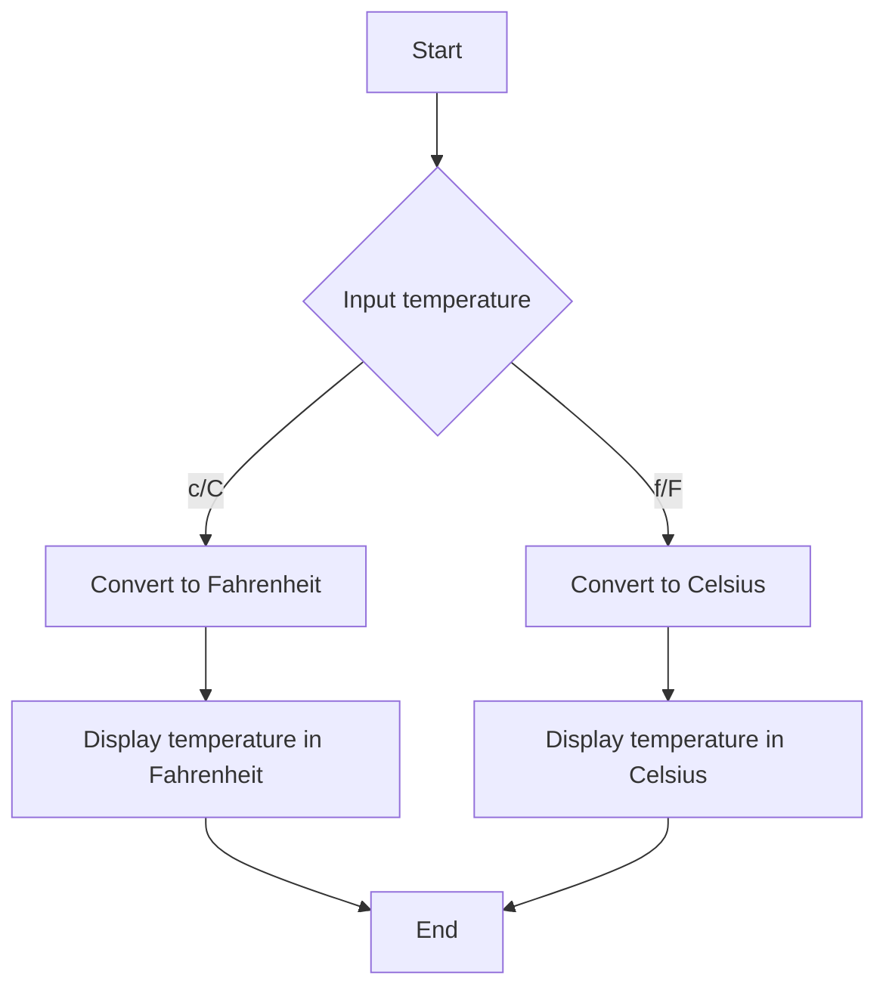

```mermaid
graph TD;
    A[Start] --> B{Input temperature};
    B --> |"c/C"| C[Convert to Fahrenheit];
    B --> |"f/F"| D[Convert to Celsius];
    C --> E[Display temperature in Fahrenheit];
    D --> F[Display temperature in Celsius];
    E --> G[End];
    F --> G;
```
