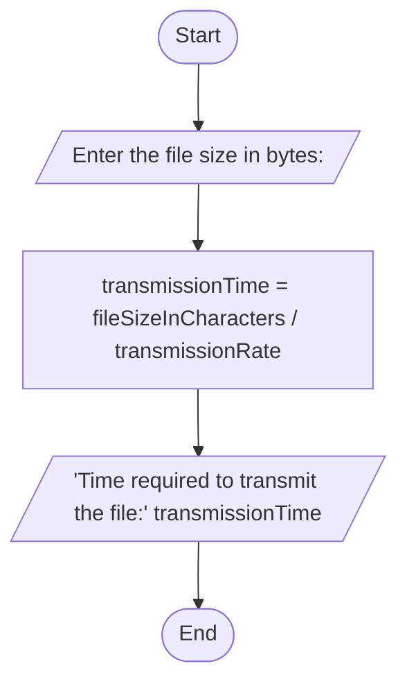

A.) Problem Analysis:

The task requires creating a program that calculates the time needed to send a file over a serial transmission line given the file size, considering a transmission speed of 960 characters per second. The file size provided is 400MB (419,430,400 bytes), and the transmission speed is 960 characters per second. Here is the problem analysis:

Input:

Transmission speed: 960 characters per second (constant value).
File size: 400MB (419,430,400 bytes) - this is the value we will work with.
Calculation:

Convert the file size to bits, as transmission speed is in characters per second (1 byte = 8 bits).
Calculate the time required to transmit the entire file using the formula: timeInSeconds = fileSizeBits / transmissionSpeed.
Output:

Display the calculated time in days, hours, minutes, and seconds.
B.)Aligorithm Design:

Start
1Declare constants:
2 transmissionSpeed = 960 characters per second
3 fileSizeBytes = 419,430,400 bytes (400MB)
4 Calculate the file size in bits:
5 fileSizeBits = fileSizeBytes * 8 (convert bytes to bits)
 6 Calculate the time required to send the file:
7 timeInSeconds = fileSizeBits / transmissionSpeed
8 Convert timeInSeconds to days, hours, minutes, and seconds.
9 Display the calculated time to the user.
End

#Folw chart

