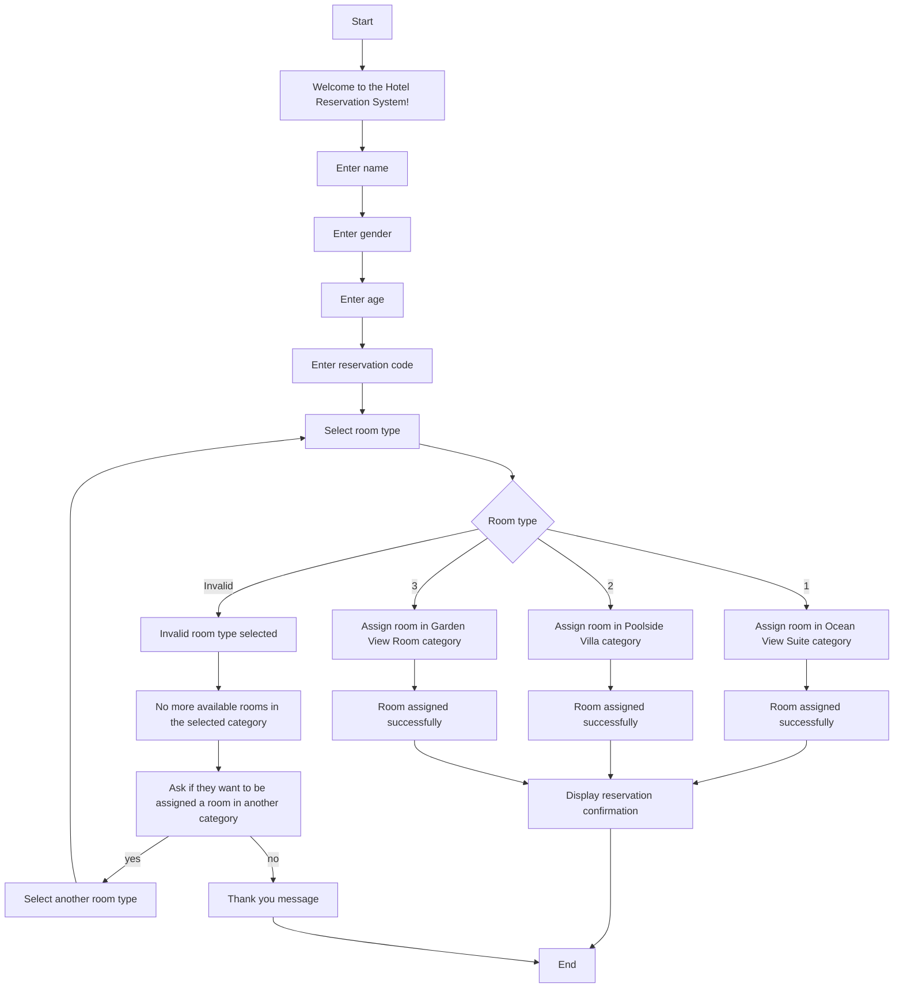

CODE DESCRIPTION
To meet the needs of a newly established hotel, we will develop an automated room reservation system in C++. This system will assign rooms for each night in the hotel, which has a total of 150 rooms. The program will present users with a menu to choose the room type they want: Ocean View Suite, Poolside Villa, or Garden View Room.

PSEUDOCODE

     step 1 start
     step 1. Declare and initialize constants for the total number of rooms and room number ranges for each room type.
     
     step 2. Declare variables for name, gender, age, reservation code, room number, and room type.
     
     step 3. Display a welcome message.
     
     step 4. Prompt the user to enter their name and store it in the name variable.
     
     step 5. Prompt the user to enter their gender and store it in the gender variable.
     
     step 6. Prompt the user to enter their age and store it in the age variable.
     
     step 7. Prompt the user to enter their reservation code and store it in the reservationCode variable.
    
     step 8. Display the room type options.
    
     step 9. Prompt the user to select a room type and store it in the roomType variable.
    
     step 10. Use conditional statements to assign the initial room number based on the selected room type.
   
     step 11. Use a while loop to check if a room is available in the selected category.
   
     step 12. If a room is available, assign the room and set roomAssigned to true.
   
     step 13. If no room is available, prompt the user if they want to be assigned a room in another category.

     step 14. If the user wants to select another room type, repeat steps 8-10 and reset the room number counter.
   
     step 15. If the user does not want to select another room type, display a farewell message and exit the program.
   
     step 16. If a room is assigned, display the reservation confirmation details.
  
     step 17. Additional features can be implemented after the reservation confirmation.
 
     step 18. End the program.

FLOWCHART BY USING MERMAID SYNTAX

